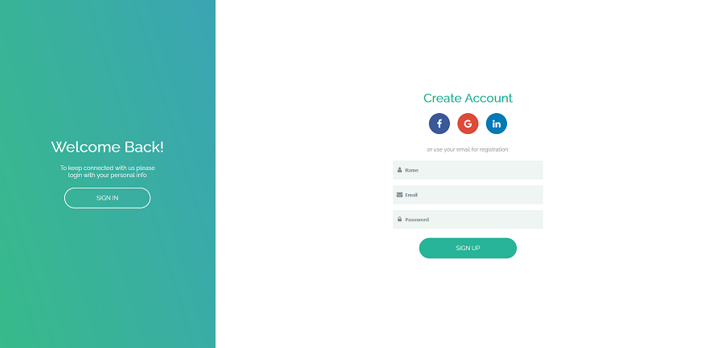

# diprella-app

<b>About:</b>  
Implementation of a login screen mockup found on Dribble.  
https://dribbble.com/shots/5311359-Diprella-Login  

-Utilizing CSS animations and JS solution.  
-With responsive design  
-Use of webpack for development and production  

<b>How to run:</b>  
1 - Clone repo  
2 - Open dist/index.html or after 'npm install', use 'npm start'  

